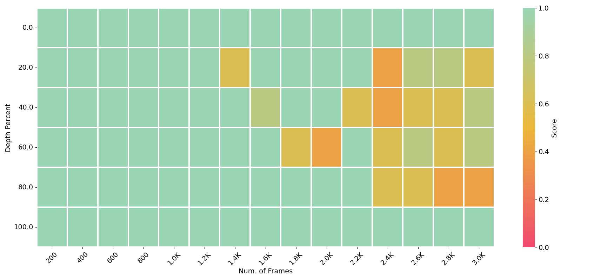

# LongVA_CD
<p align="center">
    
</p>

<p align="center">
    🌐 <a href="https://lmms-lab.github.io/posts/longva/" target="_blank">Blog</a> | 📃 <a href="https://arxiv.org/abs/2406.16852" target="_blank">Paper</a> | 🤗 <a href="https://huggingface.co/collections/lmms-lab/longva-667538e09329dbc7ea498057" target="_blank">Hugging Face</a> | 🎥 <a href="https://longva-demo.lmms-lab.com/" target="_blank">Demo</a>

</p>

  

Long context capability can **zero-shot transfer** from language to vision.

LongVA can process **2000** frames or over **200K** visual tokens. It achieves **state-of-the-art** performance on Video-MME among 7B models.

## News


- [2024/08/08] 🔥 Released training code for vision text alignment.
- [2024/06/24] 🔥 LongVA is released. Training code for vision text alignment is coming soon.
  
## Installation 
This codebase is tested on CUDA 11.8 and A100-SXM-80G.
```bash
conda create -n longva python=3.10 -y && conda activate longva
pip install torch==2.1.2 torchvision --index-url https://download.pytorch.org/whl/cu118
pip install -e "longva/.[train]"
pip install packaging &&  pip install ninja && pip install flash-attn==2.5.0 --no-build-isolation --no-cache-dir
pip install -r requirements.txt
```


## Local Demo

```bash
# For CLI inference
pip install httpx==0.23.3
python local_demo/longva_backend.py --video_path local_demo/assets/dc_demo.mp4 --question "What does this video show?" --num_sampled_frames 32 --device auto
python local_demo/longva_backend.py --image_path local_demo/assets/lmms-eval.png --question "What is inside the image?"

# For multimodal chat demo with gradio UI
python local_demo/multimodal_chat.py
```

### Quick Start With HuggingFace

<details>
    <summary>Example Code</summary>
    
```python
from longva.model.builder import load_pretrained_model
from longva.mm_utils import tokenizer_image_token, process_images
from longva.constants import IMAGE_TOKEN_INDEX
from PIL import Image
from decord import VideoReader, cpu
import torch
import numpy as np
# fix seed
torch.manual_seed(0)

model_path = "lmms-lab/LongVA-7B-DPO"
image_path = "local_demo/assets/lmms-eval.png"
video_path = "local_demo/assets/dc_demo.mp4"
max_frames_num = 16 # you can change this to several thousands so long you GPU memory can handle it :)
gen_kwargs = {"do_sample": True, "temperature": 0.5, "top_p": None, "num_beams": 1, "use_cache": True, "max_new_tokens": 1024}
# you can also set the device map to auto to accomodate more frames
tokenizer, model, image_processor, _ = load_pretrained_model(model_path, None, "llava_qwen", device_map="cuda:0")


#image input
prompt = "<|im_start|>system\nYou are a helpful assistant.<|im_end|>\n<|im_start|>user\n<image>\nDescribe the image in details.<|im_end|>\n<|im_start|>assistant\n"
input_ids = tokenizer_image_token(prompt, tokenizer, IMAGE_TOKEN_INDEX, return_tensors="pt").unsqueeze(0).to(model.device)
image = Image.open(image_path).convert("RGB")
images_tensor = process_images([image], image_processor, model.config).to(model.device, dtype=torch.float16)
with torch.inference_mode():
    output_ids = model.generate(input_ids, images=images_tensor, image_sizes=[image.size], modalities=["image"], **gen_kwargs)
outputs = tokenizer.batch_decode(output_ids, skip_special_tokens=True)[0].strip()
print(outputs)
print("-"*50)

#video input
prompt = "<|im_start|>system\nYou are a helpful assistant.<|im_end|>\n<|im_start|>user\n<image>\nGive a detailed caption of the video as if I am blind.<|im_end|>\n<|im_start|>assistant\n"
input_ids = tokenizer_image_token(prompt, tokenizer, IMAGE_TOKEN_INDEX, return_tensors="pt").unsqueeze(0).to(model.device)
vr = VideoReader(video_path, ctx=cpu(0))
total_frame_num = len(vr)
uniform_sampled_frames = np.linspace(0, total_frame_num - 1, max_frames_num, dtype=int)
frame_idx = uniform_sampled_frames.tolist()
frames = vr.get_batch(frame_idx).asnumpy()
video_tensor = image_processor.preprocess(frames, return_tensors="pt")["pixel_values"].to(model.device, dtype=torch.float16)
with torch.inference_mode():
    output_ids = model.generate(input_ids, images=[video_tensor],  modalities=["video"], **gen_kwargs)
outputs = tokenizer.batch_decode(output_ids, skip_special_tokens=True)[0].strip()
print(outputs)
```
</details>

## Question for environments
-- deepspeed
conda activate longlv
conda install -c conda-forge cudatoolkit-dev
which nvcc
which nvcc返回的是../m/miniconda/envs/longva/bin/nvcc
ls -l ../m/miniconda/envs/longva/bin/nvcc
export CUDA_HOME=../m/miniconda/envs/longva

--flash-attn
https://github.com/Dao-AILab/flash-attention/releases


## Acknowledgement
- LLaVA: the codebase we built upon. 
- LMMs-Eval: the codebase we used for evaluation. 

